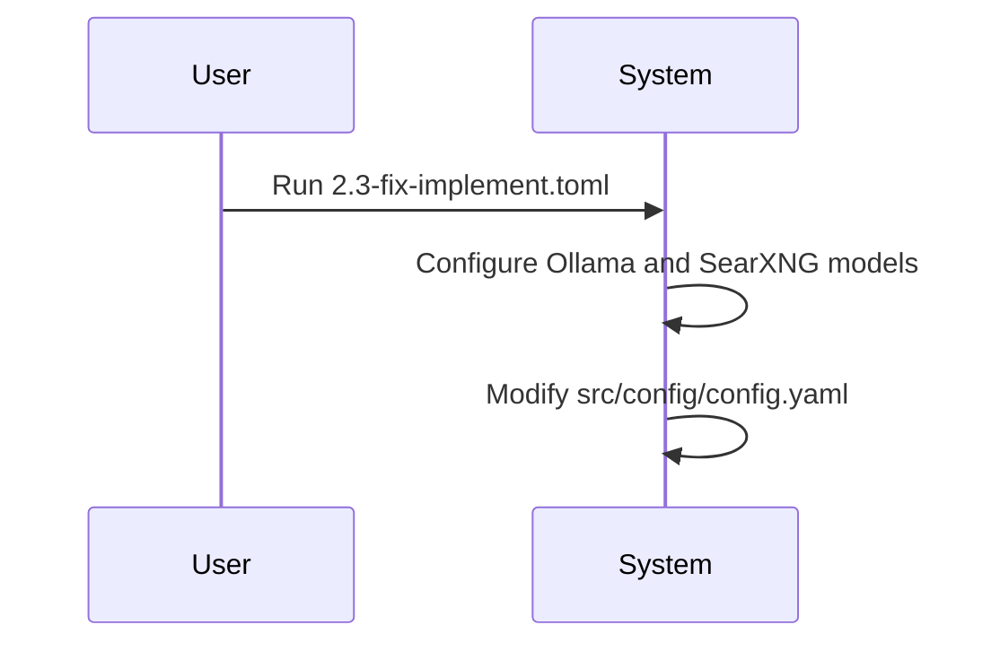

# Context Change Management Report

## 1. Change Flow Diagram

## 2. Detailed Change Log Summary

| Date       | What: The Change Implemented                                                              | Why: The Reason for the Change         | How: The Method of Implementation          | Where: The Artifact(s) Affected                                   |
| :--------- | :---------------------------------------------------------------------------------------- | :------------------------------------- | :----------------------------------------- | :---------------------------------------------------------------- |
| 2025-08-28 | Created `commands/sh/2.3-fix-implement.toml` to configure Ollama and SearXNG models. | To add new models to the configuration. | Creation of a `.toml` file with a prompt. | `commands/sh/2.3-fix-implement.toml`, `src/config/config.yaml` |
