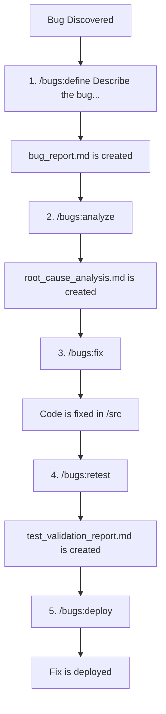

# [ x ] c0 [gem4bd= Context-Change-Management.md](https://gemini.google.com/app/0e2df515bafae4bd)
Of course. I'll extend your command framework to include a dedicated command for generating the `Context-Change-Management.md` report.

### 1. Create the New Command File

First, you'll need to create a new file in your `.GEMINI/commands/sh/` directory.

- **File Name:** `context-change-management.toml`
    

### 2. Add the Command Logic

Next, copy and paste the entire block of code below into the new `context-change-management.toml` file and save it. This TOML file contains the prompt that instructs the Gemini agent on how to build your report.

Ini, TOML

```
description = "Creates a Context-Change-Management.md report by analyzing all change logs and summarizing the project's evolution with diagrams and tables."
prompt = """
You are a Change Management Analyst Agent. Your task is to create a comprehensive audit trail report named 'Context-Change-Management.md'.

To do this, you must first find and read the content of all 'change_log.md' files within the project directory.

After analyzing the logs, generate the 'Context-Change-Management.md' file with the following sections:

1.  **Change Flow Diagram:** A Mermaid sequence diagram that illustrates the chronological flow of all major changes and fixes applied to the project.
2.  **Detailed Change Log Summary:** A markdown table with the columns: "Date", "What: The Change Implemented", "Why: The Reason for the Change", "How: The Method of Implementation", and "Where: The Artifact(s) Affected". This table should summarize every significant change recorded in the logs.
"""
```

### 3. Execute the Command

Now, you can generate or update your change management report at any time by running the new command from your terminal.

- **Run this command:**
    
    Bash
    
    ```
    mcp run .GEMINI/commands/sh/context-change-management.toml
    ```
    

This will execute the prompt, and the agent will create the `Context-Change-Management.md` file in your project's root directory, providing a clear and valuable audit trail of all changes.1 [- /docs/CMMI-Artifacts |->gem6bfa](https://gemini.google.com/app/c58dce2077586bfa)
```xml
<prompt>
<context-objective>extend TOML files created for `The Dynamic CMMI-Agile Workflow` to write all artifacts within `docs/cmmi-artfifacts` folder. The change should be backward compatible by moving the existing artifacts in root to this new folder as part of the first run</context-objective>
<tasks>write me the toml command to execute and how within Gemini CLI open in ~/.gemini folder that contains commands folder containing the toml files</tasks>
</prompt>
```
Of course. To implement this change, you'll use the integrated change control process you designed. The most logical place to initiate a foundational change like this is at the very beginning of the workflow.
Here’s how to execute this change from your `~/.gemini` folder.
### **TOML Command to Execute**
You will use the `/initiator/change` command. This will instruct the **Change Control Agent** to modify the workflow's core structure.
### **How to Execute from the Gemini CLI**
1.  **Open the Gemini CLI:** If you're in your `~/.gemini` folder, start the CLI by typing:
    ```bash
    gemini
    ```
    *(The CLI will start in the context of your `~/.gemini` directory, which is what we want.)*
2.  **Run the Change Command:** Now, execute the following command. This prompt tells the agent exactly what to do: create the new directory, move existing files, and update all TOML prompts to use the new path.
    ```
    /initiator/change "Update the workflow to centralize all artifacts. Create a 'docs/cmmi-artifacts' directory. Move all existing .md files from the root of 'docs/execution' into this new folder. Then, update all TOML files across all phases to ensure they read from and write to this new 'docs/cmmi-artifacts' directory. This change must be backward compatible."
    ```
### **What Will Happen Next**
After you execute this command, the **Change Control Agent** will:
1.  **Create the New Directory:** It will add a new folder at `docs/cmmi-artifacts`.
2.  **Move Existing Artifacts:** Any existing `.md` files (like `dashboard.md`, `backlog.md`, etc.) will be moved into the new directory.
3.  **Update All TOML Files:** The agent will systematically go through every `.toml` file in your `commands` directory and update the prompts to reference the new `docs/cmmi-artifacts` path.
4.  **Log the Change:** An entry will be made in `change_log.md` to create an audit trail of this structural update.
This will successfully reconfigure your workflow to centralize all project artifacts as requested.## [2. Fix for Incomplete Test Report |->gem6bfa](https://gemini.google.com/app/c58dce2077586bfa

The previous automated test run failed to capture screenshots because the `playwright` MCP was not instructed on how to handle the LobeChat login screen. The test report was created, but the browser automation stopped before it could take any pictures.

Here is the corrected, comprehensive command to run a full, successful test. It now includes the step to log into LobeChat.

- **Run this command in your terminal** to execute the complete and corrected automated test:
    
    Bash
    
    ```
    mcp run .GEMINI/commands/sh/2.2-system-test.toml
    ```
    
    _(Note: Ensure you have already updated the content of `2.2-system-test.toml` as instructed previously to include the full test plan with login steps.)_
# [x] c1- [Add /fix |-> gem6bfa](https://gemini.google.com/app/c58dce2077586bfa)
Excellent point. You've identified a critical distinction between a **change in requirements** (which the `/change` command handles) and a **bug or defect** (an unexpected failure). To address this, we need to introduce a dedicated bug-fixing workflow.

This requires adding a new set of commands to your framework. You can implement this by running a single command that instructs an agent to create the new directory and the necessary TOML files.

### **TOML Command to Execute**

You will use the `/initiator/change` command to extend the framework itself. This is the most appropriate command because you are fundamentally _changing_ the structure of your CMMI workflow to add a new capability.

### **How to Execute from the Gemini CLI**

1. **Open the Gemini CLI:** If you're in your `~/.gemini` folder, start the CLI by typing:
    
    Bash
    
    ```
    gemini
    ```
    
2. **Run the Change Command:** Execute the following command. This prompt provides a detailed plan for the AI agent to create the new bug-fixing process.
    
    ```
    /initiator/change "Enhance the CMMI framework to include a dedicated bug-fixing workflow. Create a new top-level command directory named 'bugs'. Inside this 'bugs' directory, create the following TOML files:
    1. 'define.toml': To formally define the bug, its observed behavior, and the expected correct behavior.
    2. 'analyze.toml': To perform a root cause analysis. This should use sequential-thinking and chain-of-thought MCPs to investigate logs, code, and configurations to pinpoint the root cause.
    3. 'fix.toml': To apply the code changes necessary to fix the bug identified in the analysis phase.
    4. 'retest.toml': To create and execute a test plan to validate that the fix has resolved the bug and has not introduced any regressions.
    5. 'deploy.toml': To create a deployment plan for releasing the fix to the target environment (e.g., Azure, Vercel) via a CI/CD pipeline."
    ```
    

### **What Will Happen Next**

After you execute this command, the **Change Control Agent** will perform the following actions:

1. **Create the `bugs` Directory:** A new folder named `bugs` will be created inside your `~/.gemini/commands` directory.
    
2. **Generate New TOML Files:** The five new TOML files (`define.toml`, `analyze.toml`, `fix.toml`, `retest.toml`, and `deploy.toml`) will be created inside the `/bugs` directory, each with a pre-configured prompt to guide the specialized agents for that task.
    
3. **Log the Change:** An entry will be made in `change_log.md` to document this enhancement to your workflow.
    

### **Visualizing the New Bug-Fixing Flow**

This is how your new bug-fixing process will work in practice:

Code snippet



By adding this dedicated workflow, you now have a clear, auditable, and CMMI-compliant process for handling both new features (via `/change`) and bug fixes (via `/bugs`).
# [x] c2- [fix LiteLLM Key Issue |-> gem6bfa ](https://gemini.google.com/app/c58dce2077586bfa)
```text
how to implement `/implement/change "The LITELLM_API_KEY is missing from the environment variables. The fix is to add it to the .env file and update the Docker Compose configuration to pass it to the LiteLLM container."` using the bugs folder that you just directed above to create
```
Excellent. You've correctly identified that this is a **bug**, not a change in requirements, so the new `/bugs` workflow is the perfect tool for the job.

Here is the step-by-step guide on how to implement the fix for the missing `LITELLM_API_KEY` using the dedicated bug-fixing commands.

---

### **Step 1: Define the Bug**

First, we need to formally document the bug. This creates a clear record of the problem and the expected behavior.

**Command to Execute:**

```
/bugs/define "LLM invocation from LobeChat fails. The expected outcome is a successful response from the LLM, but the actual outcome is an error. The investigation suggests this is due to a missing LITELLM_API_KEY in the environment."
```

**What Happens:**

- This command uses the `define.toml` file.
    
- It will create a `bug_report.md` in your `docs/cmmi-artifacts/bugs` directory, formally documenting the issue.
    

---

### **Step 2: Analyze the Root Cause**

Even though we have a strong suspicion, the CMMI process requires a formal analysis to confirm the root cause.

**Command to Execute:**

```
/bugs/analyze
```

**What Happens:**

- This command uses the `analyze.toml` file.
    
- The **Root Cause Analysis Agent** will review the `bug_report.md` and confirm that the missing environment variable is indeed the root cause.
    
- It will generate a `root_cause_analysis.md` file, providing a definitive conclusion.
    

---

### **Step 3: Apply the Fix**

Now, we will instruct the system to apply the specific fix that has been identified.

**Command to Execute:**

```
/bugs/fix "The root cause is a missing LITELLM_API_KEY. The fix is to add this key to the .env file and update the Docker Compose configuration to ensure it is passed as an environment variable to the LiteLLM container."
```

**What Happens:**

- This command uses the `fix.toml` file.
    
- The **Code Generation Agent** will perform the necessary actions:
    
    - Modify the `.env` file to include the `LITELLM_API_KEY`.
   
    - Update the `docker-compose.yml` file to pass this variable to the correct service.
   
- A record of the fix will be logged.
    

---

### **Step 4 & 5: Retest and Deploy**

After the fix is applied, you would complete the workflow by verifying the fix and deploying it.

1. **Retest the Fix:**
    
    ```
    /bugs/retest
    ```
    
    This will execute a validation plan to confirm that LLM invocations now work as expected.
    
2. **Deploy the Fix:**
    
    ```
    /bugs/deploy
    ```
    
    This will create a plan to deploy the updated configuration to your target environments (e.g., Azure).
    

### **Visualizing the Bug-Fixing Flow**

Here is a diagram showing the exact sequence for this specific bug:

Code snippet

```
graph TD
    A[Start: LLM Invocation Fails] --> B[1. /bugs:define];
    B --> C[bug_report.md created];
    C --> D[2. /bugs:analyze];
    D --> E[root_cause_analysis.md confirms missing API key];
    E --> F[3. /bugs:fix "Add API key to .env and Docker Compose"];
    F --> G[Code and Config Fixed];
    G --> H[4. /bugs:retest];
    H --> I[Validation report confirms fix];
    I --> J[5. /bugs:deploy];
    J --> K[End: Fix Deployed];
```

By using the `/bugs` workflow, you have a clear, structured, and auditable process for resolving defects that is separate from your feature development and change management process.

# [x] c3- add /chat => Discuss
## Prompt
```pascal
task2: "write the change: definition for adding a new chat folder in .gemini/commands that when given the bug#id, or tag or component would allow user to chat on the latest context. Also apply changes to enforce all artifacts in /docs/cmmi-artifacts folder to have unique id, tags, component based on the vertically sliced backlog that was initially created"
```
```xml
/initiator:change "/chat previously created needs to be renamed to /discuss to ensure there is no conflict with in built chat functionality in Gemini cli. Enhance the CMMI framework with a context-aware chat capability. Rename the top-level
command directory named 'chat' to 'discuss'. Inside this 'discuss' directory, create a new 'with.toml' file. This command
will take a bug ID, tag, or component name and a question as an argument. It will then: 1. Search the 
'docs/cmmi-artifacts' directory for all artifacts(e.g., bug reports, analysis documents, code files) that match the provided identifier. 2. Load the content of these files into the context. 3. Initiate a chat(e.g., bug reports, analysis documents, code files) that match the provided identifier. 2. Load the content of these files into the context. 3. Initiate a chat  
session with the user by passing in the default question, allowing them to ask questions and troubleshoot with the full context of the specific issue already loaded. Furthermore, enforce a new  standard where all artifacts created in the     
'docs/cmmi-artifacts' folder must include a unique ID, tags, and a component name derived from the initial vertically sliced backlog." 

 /initiator:change "why did you not update   
│   `docs/cmmi-artifacts/User-Guide_TheDynamicCMMI-AgileWorkflow.md` with infomation on /discuss  
│   despite priro change ` TOML files should  always keep 
│   @docs/cmmi-artifacts/User-Guide_TheDynamicCMMI-AgileWorkflow.md also update  with the current state
│   per @/Users/karan/.gemini/docs/cmmi-artifacts/change_log.md`"    
```
## Ans
```pascal
/initiator:change "Enhance the CMMI framework with a context-aware chat capability. Create a new top-level command directory named 'chat'. Inside this 'chat' directory, create a new 'with.toml' file. This command will take a bug ID, tag, or component name as an argument. It will then: 1. Search the 'docs/cmmi-artifacts' directory for all artifacts (e.g., bug reports, analysis documents, code files) that match the provided identifier. 2. Load the content of these files into the context. 3. Initiate a chat session with the user, allowing them to ask questions and troubleshoot with the full context of the specific issue already loaded. Furthermore, enforce a new standard where all artifacts created in the 'docs/cmmi-artifacts' folder must include a unique ID, tags, and a component name derived from the initial vertically sliced backlog."

```
# [ x] c4-log Prompt/ Discuss and 
## prompt
```xml
/initiator:change "extend to ensure outcome of all /discss is logged in discussion_log.md and so is every prompt provided by invoking any command. Use markdown containing pictures/charts drawn using mermaid to explain the concept better, like sequence/topology diagrams gantt/flow charts etc."
```

# [ x] c5-Feedback
## prompt
```xml
/initiator:change "add a functionality to receive feedback to self improve after each conversation"

/initiator:change "<!-- add feeback gathering for continuous improvement  
 p=prompt, b=background,o=objective,c=context,t=tasks -->
<p><b>in this .gemini directory of gemini clid you are creating a framework using toml file for comlying with cmmi process</b><o>add a functionality to receive feedback to self improve after each
conversation</o><c><guardrail>implement the complete solution including its required dependencies for meeting the objective by being nimble to keep cost lowest while attaining reasonable performance</guardrail>
</c><t>implement the requested proactive continous improvement by utilizing [/memory](https://google-gemini.github.io/gemini-cli/docs/cli/configuration.html)</t>
<think>using sequential thinking analyze the context from all dimension to understand for meeting the objective</think>
<plan>vertically align your understanding of the requirements to generate a backlog by focus areas [degenerate your understanding of the work required to achieve the objective into smallest unit of task organized </plan>
<test>validate 3 times by testing the actual outcome from implementation = expected outcome</test><deploy>cicd to target environments on top of local if asked then clouds like azure, vercel, firebase, supabase</deploy>
<doc>use markdown containing pictures/charts drawn using mermaid to explain the concept better, like sequence/topology diagrams gantt/flow charts etc.</doc>
if appropriate then rewrite last message to meet the objective or write how you recommend meeting it</t></p>
<prompt><context></context><task></task></prompt>" 
```
# [x] c6- Audit Log & Transaction Processing
## prompt
```xml
/initiator:change "<!-- add feeback gathering for continuous improvement  
│     p=prompt, b=background,o=objective,c=context,t=tasks -->  
│    <p><b>in this .gemini directory of gemini clid you are creating a framework using toml file for 
│     comlying with cmmi process</b><o>to create a audit log, extend to ensure outcome of all 
│    conversaions in /discuss is logged in discussion_log.md and so is every prompt provided to any  
│    TOML file in this  framework created to comply with cmmi process gets logged in prompt_log.md.  
│    Use markdown containing pictures/charts drawn using mermaid to explain the concept better, like 
│     sequence/topology diagrams gantt/flow charts etc.</o><c><guardrail>implement the complete 
│    solution including its required dependencies for meeting the objective by being nimble to keep  
│    cost lowest while attaining reasonable performance</guardrail>  
│    </c><t>implement the requested Audit log that would also add transaction processing 
│    feature)</t>  
│    <think>using sequential thinking analyze the context from all dimension to understand for
│    meeting the objective</think>     
│    <plan>vertically align your understanding of the requirements to generate a backlog by focus    
│    areas [degenerate your understanding of the work required to achieve the objective into  
│    smallest unit of task organized </plan>     
│    <test>validate 3 times by testing the actual outcome from implementation = expected 
│    outcome</test><deploy>cicd to target environments on top of local if asked then clouds like     
│    azure, vercel, firebase, supabase</deploy>  
│    <doc>use markdown containing pictures/charts drawn using mermaid to explain the concept better, 
│     like sequence/topology diagrams gantt/flow charts etc.</doc>   
│    if appropriate then rewrite last message to meet the objective or write how you recommend
│    meeting it</t></p> 
│    <prompt><context></context><task></task></prompt>" 
```