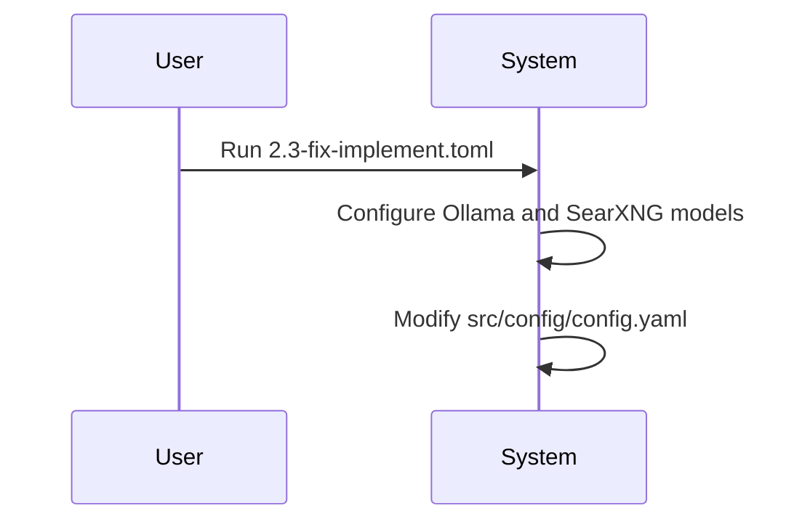

# Context Change Management Report

## 1. Change Flow Diagram

## 2. Detailed Change Log Summary

| Date       | What: The Change Implemented                                                              | Why: The Reason for the Change         | How: The Method of Implementation          | Where: The Artifact(s) Affected                                   |
| :--------- | :---------------------------------------------------------------------------------------- | :------------------------------------- | :----------------------------------------- | :---------------------------------------------------------------- |
| 2025-08-28 | Created `commands/sh/2.3-fix-implement.toml` to configure Ollama and SearXNG models. | To add new models to the configuration. | Creation of a `.toml` file with a prompt. | `commands/sh/2.3-fix-implement.toml`, `src/config/config.yaml` |

### 3. Artifact Standardization

All artifacts created in the `docs/cmmi-artifacts` folder must adhere to the following standard:

*   **Unique ID:** Each artifact must have a unique identifier.
*   **Tags:** Each artifact must be tagged with relevant keywords.
*   **Component Name:** Each artifact must be associated with a component name from the backlog.

This standard is enforced to support the context-aware chat functionality and ensure proper artifact management.

### 4. User Guide Automation

A new rule has been implemented to ensure the `User-Guide_TheDynamicCMMI-AgileWorkflow.md` is always up-to-date. With every invocation of a TOML file, the system will automatically update the user guide with the latest changes from the `change_log.md`.
