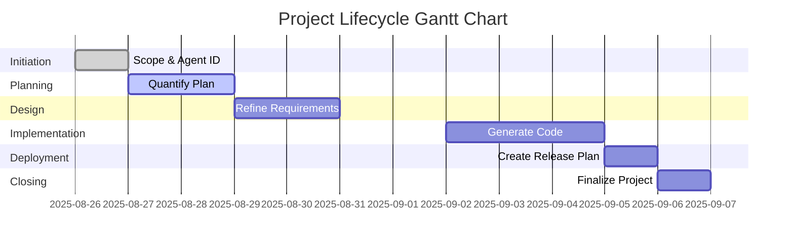
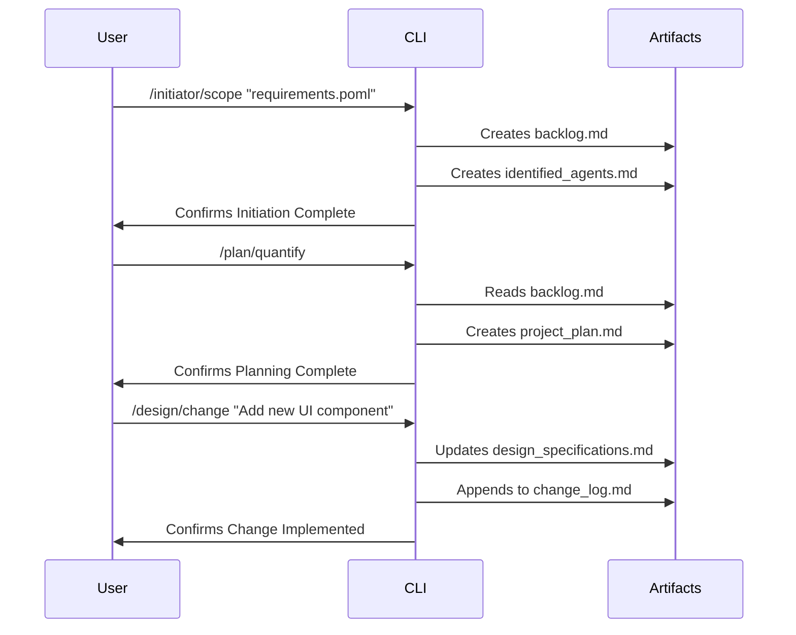

# User Guide: The Dynamic AI-Driven CMMI-Agile Workflow

Welcome to your automated, dynamic CMMI-Agile workflow. This guide explains how a series of specialized AI Agents, driven by a loosely coupled system of commands, will guide your project from initiation to closing with unprecedented flexibility and control.

Unlike rigid, predefined workflows, this framework is designed to evolve. It starts by dynamically generating a project backlog from your initial requirements and allows for changes and re-runs at any stage through an integrated change control process. The entire lifecycle is transparently tracked in a live `dashboard.md`, which now includes advanced agent performance monitoring.

## The Core Components

This workflow is built on a few key components that work together to provide a seamless and auditable project experience.

### Phase Directories

Each folder (`/initiator`, `/plan`, `/design`, `/implement`, `/deploy`, `/closing`) represents a distinct phase of the project. Inside each, you will find:

- **A core command `.toml` file** (e.g., `quantify.toml`, `refine.toml`) that executes the primary task of that phase.
    
- **A `change.toml` file** that allows you to introduce new requirements, make modifications, or re-run a step in a controlled, auditable manner.
    

### The Dashboard (`dashboard.md`)

This is the single source of truth for your project. Generated and updated by the `/dashboard.toml` command, it provides a real-time overview of:

- **Overall Project Status:** High-level progress, timelines, and key metrics.
    
- **Risks and Issues:** A live registry of potential impediments.
    
- **Change Log:** A summary of all approved changes.
    
- **Agent Performance Monitor:** A new section that tracks the output and effectiveness of each AI agent, grouped by phase, allowing you to identify which agents are performing best.
    

### Context-Aware Discussion (`/discuss`)

This new command allows you to initiate a context-aware discussion session. By providing a bug ID, tag, or component name, the command will search the `docs/cmmi-artifacts` directory for all relevant artifacts, load their content into context, and then allow you to ask questions and troubleshoot with the full context of the specific issue.

### The Change Log (`change_log.md`)

Every time you use a `change.toml` command, a record is added to this central log. This creates a complete, auditable history of every modification made to the project, ensuring that the context is never lost, even when steps are re-run. Additionally, all artifacts created in the `docs/cmmi-artifacts` folder must now include a unique ID, relevant tags, and the associated Capability name (serving as the component identifier).

## Workflow in Action: An Activity Plan

This section outlines the typical flow of activities when running a project using this framework.

### High-Level Project Gantt Chart

This chart illustrates the sequential nature of the phases, from initiation to closing.

### Sequence of Operations

This diagram shows the interaction between you (the User), the Gemini CLI commands, and the key artifacts that are created and updated throughout the process.

### Detailed Activity List

|ID|Title|Prompt Command (`/`)|Planned Duration (min)|Status|
|---|---|---|---|---|
|1|Scope Project|`initiator/scope`|30|Not Started|
|2|Create Initial Plan|`plan/quantify`|60|Not Started|
|3|Refine Technical Design|`design/refine`|90|Not Started|
|4|Generate Code|`implement/generate`|180|Not Started|
|5|**Request a Change**|`implement/change "new feature"`|45|Not Started|
|6|Create Release Plan|`deploy/release`|45|Not Started|
|7|Finalize Project|`closing/finalize`|60|Not Started|
|8|Update Dashboard|`dashboard`|15|On-Demand|

## Updated Sequence Flow Matrix

This matrix details the end-to-end workflow, now including the specific input and output files for each phase.

|Phase / Strategic Goal|Tactical File (TOML)|**Workflow Agent** & Role|Input File(s)|Output File(s)|
|---|---|---|---|---|
|**1. Initiation**|`initiator/scope.toml`|**Project Initiation Agent**|User-provided POML|`backlog.md`, `identified_agents.md`|
||`initiator/change.toml`|**Change Control Agent**|`backlog.md`|`backlog.md` (v.next), `change_log.md`|
|**2. Planning**|`plan/quantify.toml`|**Project Planning Agent**|`backlog.md`|`project_plan.md`|
||`plan/change.toml`|**Change Control Agent**|`project_plan.md`|`project_plan.md` (v.next), `change_log.md`|
|**3. Design**|`design/refine.toml`|**System Design Agent**|`project_plan.md`|`design_specifications.md`|
||`design/change.toml`|**Change Control Agent**|`design_specifications.md`|`design_specifications.md` (v.next), `change_log.md`|
|**4. Implementation**|`implement/generate.toml`|**Code Generation Agent**|`design_specifications.md`|`/src` directory code, `unit_tests.md`|
||`implement/change.toml`|**Change Control Agent**|`/src` directory code|`/src` (v.next), `change_log.md`|
|**5. Deployment**|`deploy/release.toml`|**Release Management Agent**|`/src` directory code|`release_plan.md`|
||`deploy/change.toml`|**Change Control Agent**|`release_plan.md`|`release_plan.md` (v.next), `change_log.md`|
|**6. Closing**|`closing/finalize.toml`|**Project Closure Agent**|All `.md` artifacts|`project_closure_report.md`|
|**Monitoring**|`dashboard.toml`|**Dashboard Agent**|All `.md` artifacts|`dashboard.md`|