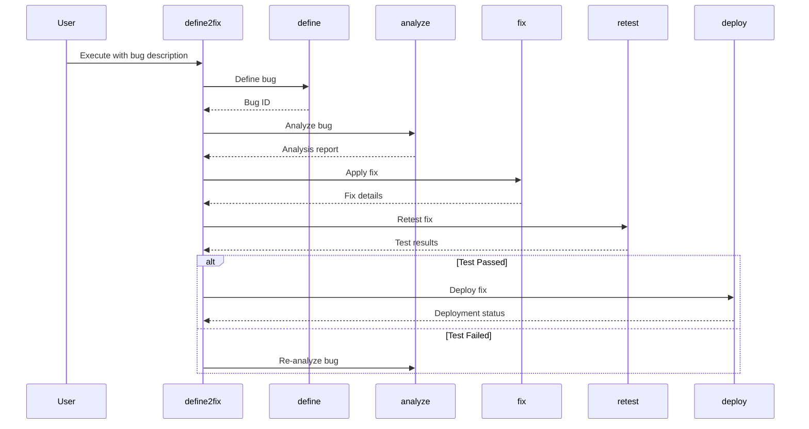

# Define2Fix Workflow

This document describes the `define2fix` command, a continuous workflow for defining, analyzing, fixing, retesting, and deploying bug fixes.

## Workflow

The `define2fix` command orchestrates the following bug-related commands in a sequential manner:

1.  **define**: Defines the bug based on a user-provided description.
2.  **analyze**: Analyzes the defined bug to determine its root cause.
3.  **fix**: Applies a fix to the bug.
4.  **retest**: Tests the applied fix to ensure it resolves the issue.
5.  **deploy**: Deploys the fix to the target environment.

### Sequence Diagram



## Usage

To use the `define2fix` command, run the following:

```
/bugs:define2fix "Description of the bug"
```
